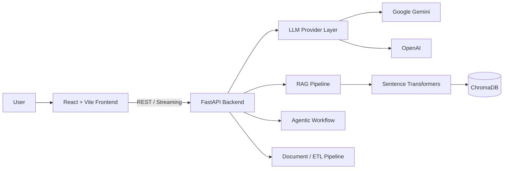

# LuminaryAI

> **AI Productivity & Engineering Studio** — a full-stack AI platform that combines everyday AI utilities with **RAG, agentic workflows, semantic search, document processing, and data pipelines**.

LuminaryAI is built as a practical AI engineering project rather than a single chatbot. It brings productivity, career, content, knowledge-retrieval, and multi-step AI workflows into one React + FastAPI application.

## ✨ What LuminaryAI Can Do

### AI Productivity
- 💬 Multi-turn AI chatbot with streaming responses
- ✍️ Prompt engineering utilities and reusable prompt templates
- 📝 Text summarization
- 🎯 Tone conversion
- 🖼️ Image-caption generation from a topic or image context

### Career & Personal Branding
- 📄 AI-assisted resume enhancement
- 🎤 Interview preparation and coaching
- 🧭 Career path recommendations
- 📚 Personalized study-plan generation
- 🌐 Portfolio content generation
- 🏆 Certificate generation
- 🎨 Personal website/theme generation
- 📑 Documentation assistance

### AI Engineering
- 🔎 **RAG** — ingest PDF/text data, create embeddings, store vectors in ChromaDB, and answer questions using retrieved context
- 🤖 **Agentic AI** — generate a plan, execute steps sequentially, pass context between steps, and synthesize a final response
- 🔄 **Data Pipeline** — extract, transform, chunk, embed, store, and inspect document-processing workflows
- 🧠 Local sentence-transformer embeddings
- 🔀 Dual LLM provider support: Google Gemini and OpenAI
- ⚡ Streaming AI responses

## 🏗️ Architecture



## 🛠️ Tech Stack

| Layer | Technologies |
|---|---|
| Frontend | React 18, Vite, Tailwind CSS, Framer Motion, Axios, React Markdown |
| Backend | Python, FastAPI, Pydantic, Uvicorn |
| Generative AI | Google Gemini, OpenAI |
| RAG | ChromaDB, Sentence Transformers, PyPDF2 |
| Data / Documents | PDF extraction, chunking, embeddings, semantic retrieval |
| Development | VS Code, npm, Python virtual environment |

## 📁 Project Structure

```text
LuminaryAI/
├── backend/
│   ├── main.py
│   └── requirements.txt
├── frontend/
│   ├── src/
│   │   ├── components/
│   │   ├── hooks/
│   │   └── pages/
│   ├── package.json
│   ├── package-lock.json
│   └── vite.config.js
├── .env.example
├── .gitignore
├── README.md
└── SETUP.md
```

## 🚀 Run Locally

### Prerequisites

- Python 3.10+ recommended
- Node.js 18+ recommended
- A Google Gemini API key
- OpenAI API key is optional

### 1. Clone the repository

```bash
git clone https://github.com/ankithavc14-maker/LuminaryAI.git
cd LuminaryAI
```

### 2. Configure the backend

```bash
cd backend
python -m venv venv
```

**Windows:**

```bash
venv\Scripts\activate
```

**macOS/Linux:**

```bash
source venv/bin/activate
```

Install dependencies:

```bash
pip install -r requirements.txt
```

Create the environment file from the project root:

```bash
copy .env.example .env
```

On macOS/Linux:

```bash
cp .env.example .env
```

Then add your API keys to `.env`.

### 3. Start the FastAPI backend

From `backend/`:

```bash
uvicorn main:app --reload --port 8000
```

### 4. Start the React frontend

Open another terminal:

```bash
cd frontend
npm install
npm run dev
```

Open the local Vite URL shown in the terminal, normally:

```text
http://localhost:5173
```

The Vite development server proxies `/api` requests to the FastAPI backend on port `8000`.

## 🔐 Environment Variables

Never commit your real API keys.

Create `.env` locally using `.env.example`:

```env
GEMINI_API_KEY=your_real_key
OPENAI_API_KEY=your_real_key
```

The repository's `.gitignore` excludes `.env` and other local secrets.

## 🔌 Core API Areas

| Area | Example endpoint | Purpose |
|---|---|---|
| Chat | `POST /api/chat` | Streaming conversational AI |
| Prompt Engineering | `POST /api/prompt-engineering` | Generate task-specific prompts/content |
| Summarization | `POST /api/summarize` | Condense text into key points |
| Career | `POST /api/career` | Generate career guidance |
| Interview | `POST /api/interview` | Interview preparation |
| RAG Ingestion | `POST /api/pipeline/ingest-pdf` | Index PDF content |
| RAG Query | `POST /api/rag/query` | Retrieve context and answer questions |
| Agent | `POST /api/agent/run` | Execute multi-step AI workflows |
| Pipeline | `GET /api/pipeline/status` | Inspect data-pipeline state |
| Health | `GET /api/health` | Backend health/config status |

## 🧠 RAG Workflow

```text
Document
   ↓
PDF/Text Extraction
   ↓
Chunking
   ↓
Sentence-Transformer Embeddings
   ↓
ChromaDB
   ↓
Semantic Retrieval
   ↓
Retrieved Context + User Question
   ↓
LLM Response
```

This approach allows LuminaryAI to answer questions using information retrieved from the user's uploaded knowledge base instead of relying only on the model's general knowledge.

## 🤖 Agentic AI Workflow

```text
User Goal
   ↓
Plan Generation
   ↓
Step 1 → Step 2 → Step 3 → ...
   ↓
Context Passed Between Steps
   ↓
Final Synthesis
```

The agent module is designed for tasks where a single prompt-response cycle is insufficient and the system needs to decompose a goal into multiple steps.

## 📸 Screenshots

Screenshots can be added under `docs/screenshots/` and linked here as the project UI is finalized.

Suggested showcase images:

1. Main dashboard
2. RAG document upload + query
3. Agentic AI workflow
4. Data pipeline
5. Career / resume tools

## 🎯 Why I Built This

LuminaryAI was built to explore how multiple AI engineering patterns can work together in a single application — from prompt-based utilities to **RAG, vector search, embeddings, agentic workflows, streaming APIs, and full-stack integration**.

## 🔮 Future Improvements

- Persistent user authentication and per-user workspaces
- Production vector-store persistence
- Background jobs for long-running document ingestion
- Evaluation metrics for RAG quality
- Conversation and document history
- Containerized deployment
- Automated CI/CD and test coverage

## 👩‍💻 Author

**Ankitha V Chandan**  
MCA | Python | AI/ML | Generative AI

- GitHub: https://github.com/ankithavc14-maker
- Portfolio: _add your live portfolio URL here_
- LinkedIn: _add your LinkedIn URL here_

---

⭐ If you find this project useful, consider giving the repository a star.
